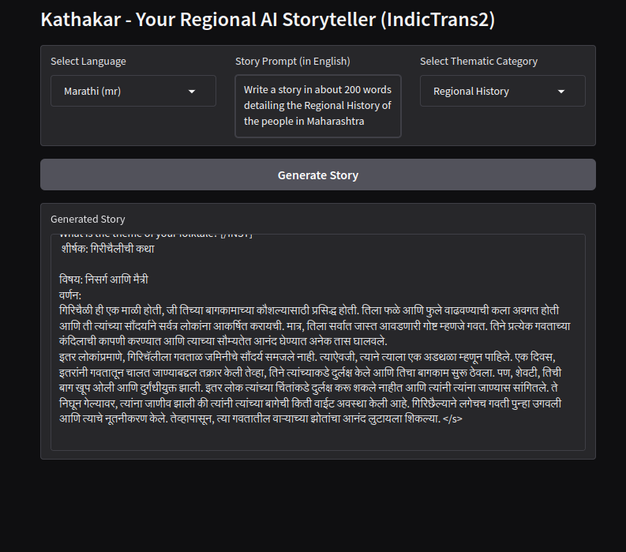

# Kathakar

Kathakar is a project that leverages fine-tuning to enable a Large Language Model (LLM) to generate short stories effectively in Indic languages. It is powered by Sarvam-1.

Kathakar has been fine-tuned using a custom dataset of 3,000 Indian folklore and folktales sourced from various books that have been open-sourced through Project Gutenberg. Due to the limited availability of stories in specific Indic languages such as Marathi and Hindi, the initial 3,000 Indian stories were translated into multiple target languages to enhance the fine-tuning process. This model currently supports story generation in:

1. Hindi (hi)
2. Bengali (bn)
3. Gujarati (gu)
4. Kannada (kn)
5. Malayalam (ml)
6. Marathi (mr)
7. Oriya (or)
8. Punjabi (pa)
9. Tamil (ta)
10. Telugu (te)
11. English (en)

Note - Through extensive experimentation, I observed that the model generates stories in regional languages (such as Hindi or Marathi) only when the input prompt is provided in that respective language. If the prompt is in English, the output often defaults to English, even when a regional language is selected. To address this, I integrated [IndicTrans2](https://ai4bharat.iitm.ac.in/areas/model/NMT/IndicTrans2), which first translates the user's prompt from English to the selected regional language before passing it to the story generation model. This ensures that the model receives a prompt in the correct language, leading to more accurate and fluent story generation in the desired regional language.
To further augment the training data, additional datasets were incorporated from Kaggle, including:

* [1002 Short Stories from Project Gutenberg](https://www.kaggle.com/datasets/shubchat/1002-short-stories-from-project-guttenberg)
* [Reddit Short Stories](https://www.kaggle.com/datasets/trevordu/reddit-short-stories)

## Dataset

The dataset used for fine-tuning is available through this [link](insert).

## Tech-stack
The project is built with the help of the following libraries
1. Python Programming language
2. Gradio (For UI)
3. Huggingface suite (for finetuning)

## Screenshots

#### Example of a story in English Language

#### Example of a story in Marathi Language

### Literature

The following papers were reviewed and utilized in the development of this project, categorized for clarity:

**Fine-Tuning Techniques:**

1.  [LoRA: Low-Rank Adaptation of Large Language Models](https://arxiv.org/abs/2106.09685) - Focused on efficient adaptation of LLMs.
2.  [QLoRA: Efficient Finetuning of Quantized LLMs](https://arxiv.org/abs/2305.14314) - Explores efficient fine-tuning of quantized LLMs.

**Large Language Models & Indic Languages:**

1.  [Sarvam 1: The first Indian language LLM](https://www.sarvam.ai/blogs/sarvam-1) - Introduces the base LLM used in this project.
2.  [IndicGenBench: A Multilingual Benchmark to Evaluate Generation Capabilities of LLMs on Indic Languages](https://arxiv.org/abs/2404.16816) - Provides a benchmark for evaluating LLM performance in Indic languages.